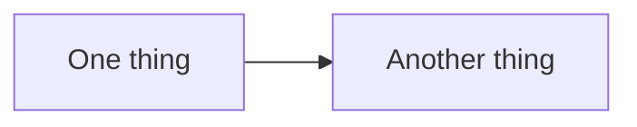

Copy this file and rename it to your-post-slug.md — the filename becomes the URL (/blog/your-post-slug).

## Subheadings use two hash marks

Everything that is not a heading or a list item is rendered as a paragraph.

- Bullet lists start with a dash
- Blank lines break a list apart
- Lists render with bullets

## Keep it brutalist

Standard markdown is supported (GFM): paragraphs, subheadings, bullet/numbered lists, **bold**, *italics*, `inline code`, fenced code blocks, blockquotes, images, tables, and [links](https://example.com). Use emphasis sparingly — only where a phrase genuinely carries the argument.

## Diagrams

Fenced blocks tagged ```mermaid render as diagrams:



Not every post needs one. Add a diagram only when it clarifies structure that prose can't.