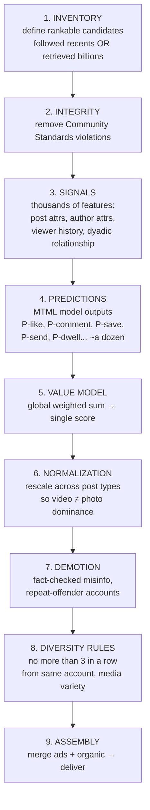
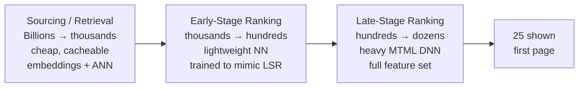
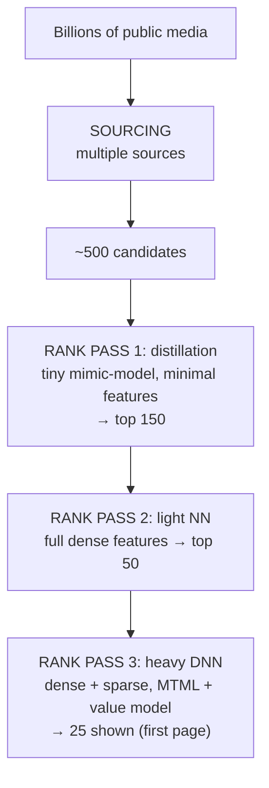
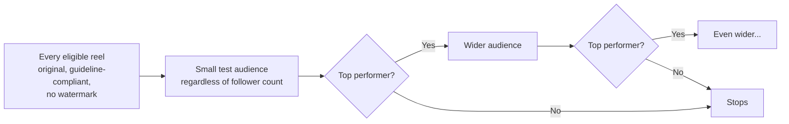
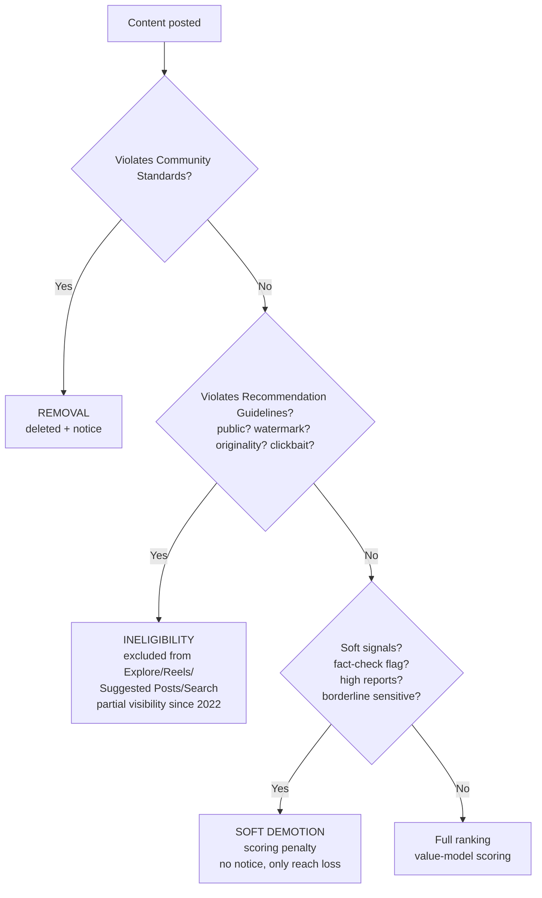

> There is no single Instagram algorithm. There are ~9 ranking funnels × dozens of models each, spanning Feed, Stories, Reels, Explore, Search, comments, notifications — 1,000+ production models in total. Personalization lives in predicted probabilities; the weights that combine them are global product decisions; 40% of what you see is chosen from beyond your follow graph; and beneath ranking sits an invisible enforcement substrate that decides who may compete at all.

This is the evidence. Every claim below links to its source. Grades mark source class: **[A]** official engineering / system cards, **[B]** executive / earnings, **[C]** peer-reviewed, **[D]** leaks / journalism. Unmarked = inline citation.

## The timeline — how we got here

Instagram did not improve one algorithm. It replaced architectures under product pressure.

```mermaid
flowchart LR
    A["2010<br/>Chronological only"] --> B["2016-03-15<br/>Ranked Feed<br/>70% miss rate"]
    B --> C["2020-08<br/>Suggested Posts + Reels"]
    C --> D["2020-12<br/>First tech disclosure<br/>MTML + LambdaRank"]
    D --> E["2021-06-08<br/>Shedding More Light"]
    E --> F["2021-09<br/>Facebook Files leak"]
    F --> G["2022-01-05<br/>Home / Favorites / Following"]
    G --> H["2022-07<br/>15% → 30% AI target"]
    H --> I["2023-Q1<br/>~40% recommended<br/>+24% time spent"]
    I --> J["2023-05-31<br/>Ranking Explained<br/>+ 22 system cards"]
    J --> K["2024-04-30<br/>Originality correction"]
    K --> L["2024-12-10<br/>Trial Reels"]
    L --> M["2025-05-21<br/>1,000+ models"]
    M --> N["2026-07<br/>OneShot deployed"]
```

| Date | Event | What shifted |
|---|---|---|
| Oct 2010 | Launch | Single chronological stream |
| Mar 15, 2016 | Ranked Feed announced [WIRED](https://www.wired.com/2016/03/instagram-will-soon-show-thinks-want-see/) [The Verge](https://www.theverge.com/2016/3/15/11241184/instagram-new-feed-sort-algorithm) | Cited 70% miss rate, incl. half of close-connection posts — *"make sure the 30 percent you see is the best 30 percent"* — rollout to single-digit % as experiment, **not optional** unlike Twitter at the time |
| Aug 2020 | Suggested Posts in Feed + Reels | Hybrid inventory arrives — "a middle ground" between connected Feed and full Explore [Designing a Constrained Exploration System](https://about.instagram.com/blog/engineering/designing-a-constrained-exploration-system) |
| Dec 2020 | [How Instagram Suggests New Content](https://engineering.fb.com/2020/12/10/web/how-instagram-suggests-new-content/) | First full disclosure: seeds, embeddings kNN, co-occurrence mining, MTML, GBDT, LambdaRank |
| Jun 8, 2021 | [Shedding More Light](https://about.instagram.com/blog/announcements/shedding-more-light-on-how-instagram-works) | Central claim: *"Instagram doesn't have a singular algorithm"* — reiterated May 2023 in [Ranking Explained](https://about.instagram.com/blog/announcements/instagram-ranking-explained) |
| Sep–Dec 2021 | [Facebook Files](https://www.wsj.com/articles/the-facebook-files-11631713039) [D] | Leaked teen-well-being research → Mosseri's first Senate testimony Dec 2021 |
| Jan 5, 2022 | [Home / Favorites / Following](https://techcrunch.com/2022/01/05/instagram-chronological-feed/) | Six-year reversal: ranked feed becomes *default*, not monopoly |
| Jul 2022 | Earnings call | ~15% AI-recommended, target 30%+ by end 2023 [Gizmodo](https://gizmodo.com/meta-zuckerberg-30-percent-increase-ai-driven-content-1849341849) — same quarter as "Make Instagram Instagram Again" backlash |
| Q1 2023 | [Earnings transcript PDF](https://s21.q4cdn.com/399680738/files/doc_financials/2023/q1/META-Q1-2023-Earnings-Call-Transcript.pdf) [B] | **>20% on Facebook, ~40% across all Instagram** is AI-recommended; **+24% time spent** since Reels launch attributed to AI recommendations |
| Jun 29, 2023 | [22 system cards](https://about.fb.com/news/2023/06/how-ai-ranks-content-on-facebook-and-instagram/) incl. [Feed System Card](https://ai.meta.com/tools/system-cards/instagram-feed-ranking/) [A] | Transparency artifacts + expanded "Why am I seeing this?" |
| Aug 9, 2023 | [Scaling Explore](https://engineering.fb.com/2023/08/09/ml-applications/scaling-instagram-explore-recommendations-system/) [A] | Two-Tower retrieval, hourly retraining |
| Apr 30, 2024 | [Helping Creators Find New Audiences](https://creators.instagram.com/recommendations-and-originality) [A] | Admitted large-account/aggregator bias, shipped staged-rollout fix |
| Dec 10, 2024 | [Trial Reels](https://creators.instagram.com/blog/instagram-trial-reels) [A] | Creator-side live experiments to non-followers |
| Jan 21, 2025 | [Mosseri reel](https://www.instagram.com/reel/DFFyRp-pINJ/) [B] | Current top signals: **watch time > likes > sends** (sends weighted higher for unconnected) |
| May 21, 2025 | [Journey to 1000 Models](https://engineering.fb.com/2025/05/21/production-engineering/journey-to-1000-models-scaling-instagrams-recommendation-system/) [A] | **1,000+ production models**, days→hours launch time, stability SLOs |
| Jul 2026 | [OneShot](https://www.alphaxiv.org/abs/2607.27475) [A] | Index-in-ranking rearchitecture, fully deployed on short-video |

Pattern: every regime change follows engagement economics, not UX kindness. The interaction rate fell ~40% YoY before ranked Feed existed [WIRED](https://www.wired.com/2016/03/instagram-will-soon-show-thinks-want-see/).

## The one split that explains everything

> "People tend to look for their closest friends in Stories, use Explore to discover new content and creators and be entertained in Reels." — [Ranking Explained](https://about.instagram.com/blog/announcements/instagram-ranking-explained) [A]

Instagram head Adam Mosseri's own taxonomy when explaining reach [Jan 2025 reel](https://www.instagram.com/reel/DFFyRp-pINJ/) [B]: **who defines the candidate pool**.

| Property | Connected ranking | Unconnected (recommended) |
|---|---|---|
| Surfaces | Feed (follows portion), Stories tray | Explore, Reels tab, in-feed Suggested Posts, Suggested Accounts |
| Candidate inventory | Recent posts from accounts you follow | Everything public — billions |
| Who chose the source | You (by following) | The system (via retrieval) |
| Dominant signals | Relationship history, recency | Popularity velocity, embedding similarity, predicted engagement |
| Cold-start for creators | Bounded by follower count | Potentially unbounded |
| 2025 headline weighting [B] | watch time > likes > sends | watch time > likes > sends, sends weighted up |

If a claim about "the algorithm" doesn't name a surface, it is not meaningful. Hashtags, posting time, follower count — all change truth value across this boundary.

## The canonical 9-step pipeline

Every funnel follows the same skeleton. The [Feed System Card](https://ai.meta.com/tools/system-cards/instagram-feed-ranking/) [A] states it cleanest; Explore posts describe the same shape with more stages.

Steps 1–5 are learned; 6–8 are **hand-written policy that overrules the model**. Feed order is model output ∩ governance.

### The value model, formally

Explore's blog gives the formula explicitly [Meta AI blog](https://ai.meta.com/blog/powered-by-ai-instagrams-explore-recommender-system/) [A]:

> `score = w_like·P(like) + w_save·P(save) - w_neg·P(negative action)`

With SFPLT ("See Fewer Posts Like This") as the documented negative action. Suggested Posts describes the same as a log-linear model tuned via offline replay + Bayesian optimization [Engineering at Meta 2020](https://engineering.fb.com/2020/12/10/web/how-instagram-suggests-new-content/) [A].

Two properties that matter analytically:

1. **Weights are global** — *"consistently weighs and combines these model outputs in the same way for everyone"* [system card](https://ai.meta.com/tools/system-cards/instagram-feed-ranking/) [A]. Personalization lives entirely in predicted probabilities, not weights. Weight changes are legible product decisions — e.g., elevating sends-per-reach for Reels discovery.
2. **Whatever is absent from the formula is invisible.** Actions not in the value model don't affect optimization regardless of user value — the core critique developed by independent research (see § Independent evidence).

### Funnel depth — retrieval → ESR → LSR

Unconnected funnels cannot score billions even once. The [Journey to 1000 Models](https://engineering.fb.com/2025/05/21/production-engineering/journey-to-1000-models-scaling-instagrams-recommendation-system/) [A] names the decomposition:

Concrete Explore instantiation: **500 → distillation → 150 → light NN → 50 → heavy DNN → 25 shown** [Meta AI blog](https://ai.meta.com/blog/powered-by-ai-instagrams-explore-recommender-system/) [A]. By 2023 ESR was a Two-Tower explicitly trained to predict LSR's output [Scaling Explore](https://engineering.fb.com/2023/08/09/ml-applications/scaling-instagram-explore-recommendations-system/) [A] — meaning errors in LSR propagate backwards into what ESR keeps. The retrieval/ranking boundary itself was redesigned in 2026 via OneShot (see § Reels).

Scale, quantified [A][B]:

- **65B features extracted; 90M predictions/sec** — Explore alone [Meta AI blog](https://ai.meta.com/blog/powered-by-ai-instagrams-explore-recommender-system/)
- **1,000+ production models** across Feed, Stories, Reels, comments, notifications, tag suggestions [Journey to 1000 Models](https://engineering.fb.com/2025/05/21/production-engineering/journey-to-1000-models-scaling-instagrams-recommendation-system/)
- **~40% of all content viewed** is AI-recommended from unfollowed accounts [Q1 2023 transcript](https://s21.q4cdn.com/399680738/files/doc_financials/2023/q1/META-Q1-2023-Earnings-Call-Transcript.pdf)
- **Thousands of signals** per surface [Ranking Explained](https://about.instagram.com/blog/announcements/instagram-ranking-explained), ~a dozen predictions per candidate
- **Hourly continual retraining** for Explore rankers [Scaling Explore](https://engineering.fb.com/2023/08/09/ml-applications/scaling-instagram-explore-recommendations-system/)

## Feed — the connected ranking deep dive

Feed is the oldest surface and the most completely documented: Jun 2021 → May 2023 → system card. The reconstruction is unusually precise — including *what changed*, which is itself evidence.

### Inventory

Initially simple: *"all the recent posts shared by the people you follow. There are a few exceptions, like ads"* [2021 explainer](https://about.instagram.com/blog/announcements/shedding-more-light-on-how-instagram-works) [A]. By 2023 a hybrid: *"recent posts shared by the people you follow, as well as posts from accounts you don't already follow that we think you might be interested in"* [Ranking Explained](https://about.instagram.com/blog/announcements/instagram-ranking-explained) [A]. The unconnected tail is generated by the Suggested Posts funnel, constrained by a "Feels Like Home" principle so recommendations resemble surrounding followed content.

Unlike discovery surfaces, Feed has no recall problem — the hard problem is ordering a modest recent set. That is why architecture emphasizes prediction quality over retrieval.

### Signals — thousands, four families [A]

1. **Post information** — popularity and its velocity ("how many people have liked it and how quickly people are liking, commenting, sharing and saving"), plus timestamp, duration, attached location.
2. **Person who posted** — aggregate author-level engagement ("how many times people have interacted with that person in the past few weeks").
3. **Your activity** — viewer behavior history ("how many posts you've liked").
4. **Your history with that person** — dyadic strength ("whether you comment on each other's posts").

2023 addition: **format preference** — *"if we notice you prefer photos, we'll show you more photos"* [Ranking Explained](https://about.instagram.com/blog/announcements/instagram-ranking-explained) [A] — personalized at signal level, then re-normalized at rule level.

Absent from every official list: hashtags. Only follower count appears indirectly via author-aggregate engagement, not directly.

### Predictions — ~a dozen per candidate

| Rank | 2021 [Shedding More Light](https://about.instagram.com/blog/announcements/shedding-more-light-on-how-instagram-works) [A] | 2023 [Ranking Explained](https://about.instagram.com/blog/announcements/instagram-ranking-explained) [A] |
|---|---|---|
| 1 | Spend a few seconds on a post | Spend a few seconds on a post |
| 2 | Comment | Comment |
| 3 | Like | Like |
| 4 | **Reshare** (to story/feed) | **Share** (via DM = sends) |
| 5 | Tap profile photo | Tap profile photo |

The 2021→2023 shift from reshare→sends tracks the documented migration of sharing into DMs — the same shift that made **sends-per-reach** the headline Reels metric [Mosseri Jan 2025](https://www.instagram.com/reel/DFFyRp-pINJ/) [B]. Dwell time leading is significant: the only non-explicit-feedback action among five, and the easiest to game with pause-inducing formats.

### System-card pipeline specifics [A]

1. Gather potential posts (excluding ads) from followed accounts
2. Remove Community Standards violations
3. Predict interaction likelihoods
4. Combine into single score — *same way for everyone* (global weights)
5. Repeat 1–4 for each post type (photos, videos, carousels, ads)
6. **Normalize scores within each post type** — so raw scores aren't comparable across types
7. **Demote** fact-checker-flagged misinformation + repeat-offender accounts
8. **Diversity rules** — e.g., **no more than 3 posts in a row from same account**
9. Deliver

Implications most coverage misses: step 6 explains creator confusion when "videos tanked after X date" — rebalancing, not video demotion. Step 8 proves deterministic rules override learned scores. Step 7 formalizes soft moderation — reach as moderation instrument.

### Hybrid feed constraints

When suggestions enter Feed, five clamped constraints apply [How Instagram Suggests New Content](https://engineering.fb.com/2020/12/10/web/how-instagram-suggests-new-content/) [A]: seed-source priority `H >> R > F` (Home-derived seeds outrank other-surface seeds outrank fallback graph), training-distribution balancing toward Home-like sources, shared freshness heuristics, matched media-type mixture, qualitative UX review. Recommendation share grew from ~15% mid-2022 toward the ~40% figure above.

### Controls

- **Favorites** — elevated visibility for chosen accounts [TechCrunch Jan 2022](https://techcrunch.com/2022/01/05/instagram-chronological-feed/)
- **Following** — pure reverse-chronology escape hatch
- Snooze / "show more / less" via post menus → feedback signals [Meta newsroom Jun 2023](https://about.fb.com/news/2023/06/how-ai-ranks-content-on-facebook-and-instagram/)

### Unknowns (honest gaps)

Actual weights among top five (only ordering published); how the remaining ~seven predictions enter formula; per-user unconnected share (40% is platform-wide); whether author-aggregates create follower-count priors (independent work suggests yes — see Stoica et al. below); any negative-weighting in Feed analogous to Explore's SFPLT (documented only for Explore).

## Stories — ranking the tray

Stories is the least documented major surface — and the most useful control case: the one surface Instagram **explicitly keeps connected-only**, the purest expression of relationship-based ranking.

Inventory: *"The stories you see are from people you've chosen to follow, as well as ads"* [Ranking Explained 2023](https://about.instagram.com/blog/announcements/instagram-ranking-explained) [A]. No retrieval stage at all — deliberately ("people tend to look for their closest friends in Stories") — which means story reach is bounded by follower count in a way Reels reach is not.

### Signals — three dyadic families [A]

1. **Viewing history** — how often you view an account's stories
2. **Engagement history** — frequency of likes / DM replies on their stories
3. **Closeness / relationship proximity** — overall relational strength estimate

Content-popularity velocity is absent from every published Stories signal list. *Your* relationship to the poster dominates, not how popular the story is elsewhere.

### Predictions

Documented [Ranking Explained 2023](https://about.instagram.com/blog/announcements/instagram-ranking-explained) [A]:

- How likely you are to **tap into** the next story
- How likely you are to **reply** (DM) to a story
- How likely you are to **move on to the next story** (skip)

The third is structurally notable: a negative utility term — probability of abandonment used for ordering, analogous to Explore's SFPLT demotion but applied to ranking rather than filtering. The tray optimizes attention retention per account, not raw engagement count.

### Stack evidence

The infrastructure post reveals a real model-type string: `ig_stories_tray_mtml` — `ig` = Instagram, `stories`, `tray` = main tray, `mtml` = multi-task multi-label late-stage ranker [Journey to 1000 Models](https://engineering.fb.com/2025/05/21/production-engineering/journey-to-1000-models-scaling-instagrams-recommendation-system/) [A]. Same MTML family as Feed/Explore. Naming confirms a dedicated tray model — per-surface-funnel architecture in code.

What Stories teaches: inventory choice matters more than signal weighting; negative actions are real ranking inputs; and documentation density correlates with controversy — Feed/Reels got explainers after pressure, Stories almost none despite running the same deep ML stack.

## Explore — the recommender stripped bare

Explore is the purest recommender — no social-graph crutch, candidates from everything public — and the most technically disclosed. Sources: [Meta AI Explore blog](https://ai.meta.com/blog/powered-by-ai-instagrams-explore-recommender-system/) [A], [Scaling Explore](https://engineering.fb.com/2023/08/09/ml-applications/scaling-instagram-explore-recommendations-system/) [A], [How Instagram Suggests New Content](https://engineering.fb.com/2020/12/10/web/how-instagram-suggests-new-content/) [A].

Scale framing: **>50% of the Instagram community visits Explore monthly; 65B features / 90M predictions per second** [Meta AI blog](https://ai.meta.com/blog/powered-by-ai-instagrams-explore-recommender-system/) [A].

### The funnel, end to end

Every stage trades recall against compute; survivors get progressively more expensive scoring.

### Sourcing — how candidates are found

**Seed accounts + embedding similarity.** Canonical example from Instagram [Ranking Explained](https://about.instagram.com/blog/announcements/instagram-ranking-explained) [A]: you liked @dumplingclubsf → system finds who else likes that account → what *those* people like (maybe @dragonbeaux) → sources from there. Formally [2020 post](https://engineering.fb.com/2020/12/10/web/how-instagram-suggests-new-content/) [A]: seeds = accounts/media you engaged with; account embeddings learned Word2Vec-style (treat engagement sequence as "sentence"); kNN pipelines retrieve nearest in embedding space.

**Co-occurrence mining.** Parallel non-neural source: count media-pair co-engagement frequencies across users (frequent-pattern mining), aggregate, top-N per seed [same](https://engineering.fb.com/2020/12/10/web/how-instagram-suggests-new-content/) [A]. Classic collaborative filtering alongside embeddings — redundancy is deliberate robustness.

Notably **content-agnostic**: the dumpling example works *"without us necessarily understanding what each post is about"* [Ranking Explained](https://about.instagram.com/blog/announcements/instagram-ranking-explained) [A] — behavior, not content understanding, drives sourcing. Central to popularity-bias findings below.

**Cold start fallbacks** [2020 post](https://engineering.fb.com/2020/12/10/web/how-instagram-suggests-new-content/) [A]: (1) one-hop/two-hop graph expansion for sparse-history users; (2) **globally popular items** for brand-new users until personalization accrues. New users are fed popularity before personalization exists.

**IGQL.** Sourcing queries are written in IGQL — a purpose-built DSL, statically validated, Python-like authoring, compiled/executed in C++, composable stages (*"applying a ranker is as simple as adding a one-line rule"*), combiner rules for weighted ensembles [Meta AI blog](https://ai.meta.com/blog/powered-by-ai-instagrams-explore-recommender-system/) [A]. Sourcing blend ratios (trending vs embedding vs co-occurrence) are product strategy in code — unpublished.

### Ranking passes

- **Distillation:** tiny network trained to mimic composite output of passes 2–3, optimizing NDCG over recorded teacher outputs; preselects 150 of 500 cheaply [Meta AI blog](https://ai.meta.com/blog/powered-by-ai-instagrams-explore-recommender-system/) [A].
- By 2023 this generalized: ESR trained explicitly on label *"predict LSR's output"* [Scaling Explore](https://engineering.fb.com/2023/08/09/ml-applications/scaling-instagram-explore-recommendations-system/) [A] — funnel coupling most commentary misses.
- **MTML networks + value model:** shared MLP trunk capturing cross-action commonality, task heads emitting P(like), P(save), P(SFPLT), etc. Model classes include MTML sparse NNs, GBDTs, LambdaRank minimizing NDCG directly [2020 post](https://engineering.fb.com/2020/12/10/web/how-instagram-suggests-new-content/) [A]. Score = `w_like·P(like) + w_save·P(save) - w_neg·P(negative)` with weights tuned via offline replay + online Bayesian optimization [Meta AI blog](https://ai.meta.com/blog/powered-by-ai-instagrams-explore-recommender-system/) [A].
- Explore's action set per product: *"the most important actions we predict in Explore include likes, saves, and shares,"* with post-popularity signals weighted much more heavily than in Feed/Stories [Ranking Explained](https://about.instagram.com/blog/announcements/instagram-ranking-explained) [A].

### 2023 modernization — Two-Tower retrieval [Scaling Explore](https://engineering.fb.com/2023/08/09/ml-applications/scaling-instagram-explore-recommendations-system/) [A]

- Two-Tower NN: separate user/item towers consuming arbitrary features (extending original ID embeddings); engagement = embedding proximity.
- Asymmetric serving: item tower offline daily (embeddings cached in ANN index), user tower on-the-fly with freshest features, ANN nearest-neighbor fetch.
- Interaction-history source: retrieve items similar to recent interactions directly — finer engagement-type trade-offs — with rule-based filtering of low-quality (high-report, objectionable) items.
- **Hourly continual retraining**, peak-load precomputation off-peak.
- Named future risk: *"feedback loops"* from growing complexity — platform documenting the self-reinforcement concern academics independently raise.

### "Feels Like Home" constraints for suggested posts [A]

When Explore machinery feeds into home Feed, five clamps apply: seed-source priority `H >> R > F`, training-distribution balancing toward Home-like sources, shared freshness heuristics, matched media-type mixture, qualitative UX review. Recommendation output is deliberately clamped near the follow graph when inside Feed.

| Stage | Mechanism | Scale |
|---|---|---|
| Retrieval | Seeds → embeddings kNN; co-occurrence; trending; Two-Tower ANN | billions → ~500 |
| ESR | Distillation/light NN predicting LSR | 500 → 150 → 50 |
| LSR | MTML DNN, dense+sparse | → 25 shown |
| Scoring | Weighted sum incl. negative-action penalty; Bayesian-tuned weights [A] | 65B features, 90M preds/sec |

## Reels — entertainment optimization, staged rollout, and the originality correction

Reels is the highest-stakes surface: the TikTok answer, the driver of **>24% increase in Instagram time spent** since launch [Q1 2023 transcript](https://s21.q4cdn.com/399680738/files/doc_financials/2023/q1/META-Q1-2023-Earnings-Call-Transcript.pdf) [B], and the site of the platform's most significant admitted failure — large accounts and aggregators outranking originals.

### The objective: entertainment, measured by survey [A]

From 2021:

> "With Reels, though, we're specifically focused on what might entertain you. **We survey people and ask whether they find a particular reel entertaining or funny**, and learn from the feedback to get better at working out what will entertain people." — [Shedding More Light](https://about.instagram.com/blog/announcements/shedding-more-light-on-how-instagram-works) [A]

This is rare proxy-metric alignment via human judgment: raw engagement correlates imperfectly with value, so Meta collects direct "was this entertaining?" labels. Same approach appears in [How AI Influences What You See](https://about.fb.com/news/2023/06/how-ai-ranks-content-on-facebook-and-instagram/) [A].

| 2021 [Shedding More Light](https://about.instagram.com/blog/announcements/shedding-more-light-on-how-instagram-works) [A] | 2023 [Ranking Explained](https://about.instagram.com/blog/announcements/instagram-ranking-explained) [A] |
|---|---|
| Watch all the way through | Reshare |
| Like | Watch all the way through |
| Rate entertaining/funny (survey) | Like |
| Visit audio page (creation intent proxy) | Visit audio page |

Completion rate and audio-page visits are *intent* proxies — the value model reaching beyond clicks.

### 2025 ranking: watch time > likes > sends [B]

Mosseri states current headline ordering for **both** connected and unconnected reach [reel](https://www.instagram.com/reel/DFFyRp-pINJ/) [B]:

1. **Watch time**
2. **Likes**
3. **Sends**

Asymmetry: likes weigh slightly more for connected, **sends slightly more for unconnected** — making DM-sharing the single most leveraged action for discovery. Consistent with reshare→send shift in Feed's top five, and with Reels reshares doubling in six months [Q1 2023 transcript](https://s21.q4cdn.com/399680738/files/doc_financials/2023/q1/META-Q1-2023-Earnings-Call-Transcript.pdf) [B].

### Distribution: the staged-audience rollout [A]

The April 30, 2024 announcement opens with admission [Helping Creators Find New Audiences](https://creators.instagram.com/recommendations-and-originality) [A]:

> "Historically because of how we've ranked content, creators with large followings and aggregators that share copies of original content have gotten more reach in recommendations than smaller, original content creators."

Replacement mechanism [same](https://creators.instagram.com/recommendations-and-originality) [A] [The Verge](https://www.theverge.com/2024/4/30/24144571/instagram-algorithm-ranking-recommendations-reposted-content):

Eligibility enforced upstream: **originality matching** replaces reposts with originals (audio + visual signals, only when original is recent); **aggregators** posting 10+ non-original items in rolling 30 days are removed from recommendation surfaces entirely (licensing-exempt publishers excepted). This decouples initial distribution from graph position — the closest a major platform has moved toward TikTok-style meritocratic cold-start. It is the structural fix for the popularity-bias loop that previously keyed on *how an account's followers engaged*.

### Trial Reels — creator-side experimentation [A]

Launched **Dec 10, 2024** [announcement](https://creators.instagram.com/blog/instagram-trial-reels) [TechCrunch](https://techcrunch.com/2024/12/10/instagram-rolls-out-trial-reels-that-arent-shown-to-a-creators-followers/): toggle "Trial" before publishing; reel distributed only to non-followers, hidden from followers/profile grid; ~24h later metrics + comparisons to prior trials; then share-to-everyone or auto-promotion if performs within 72h.

Architecturally, it moves exploration burden from platform bandit to creator: ideas are pre-screened against live audiences. It also manufactures clean training data — trial outcomes are unconfounded by follower-graph effects, exactly what a staged-distribution ranker wants.

### OneShot — rearchitecting retrieval (2026) [A]

A July 2026 paper documents a deployed overhaul [OneShot, alphaXiv 2607.27475](https://www.alphaxiv.org/abs/2607.27475):

- **Problem:** conventional two-stage misaligns objectives — ANN indexes (k-means/HNSW) organize geometrically while ranking optimizes engagement; retrieval hits the "dot-product bottleneck" (index search requires similarity = dot product).
- **Approach:** learn the index *inside* the ranking objective ("index-in-ranking"): hierarchical discrete codebooks trained end-to-end via straight-through estimators, non-linear neural scoring at retrieval, beam search over codebook layers, global index-balancing as stochastic compositional optimization.
- **Results:** single-layer +20% relative recall at operational ranking volume vs k-means ANN; multi-layer matches baseline recall while ranking 10× fewer items; codebook codes recover up to 80% of dense-embedding predictive power as "Engagement IDs."
- **Deployment:** *"fully deployed in Instagram's industrial short-video recommendation system,"* driving gains in daily sessions, engagement, time spent.

Conclusions: the funnel boundary of the previous chapter was redesigned at full scale within a year; each generation collapses prior heuristic boundaries into learned components (Explore 2020 → Two Towers 2023 → OneShot 2026).

## Operating 1,000 models — the infrastructure candid disclosure

[A] = [Journey to 1000 Models](https://engineering.fb.com/2025/05/21/production-engineering/journey-to-1000-models-scaling-instagrams-recommendation-system/) [A] is the least-known, most revealing source — written for engineers, not reputation management, and unusually candid.

### Why 1,000+

Not hyperbole, but combinatorial product:

> "Though what shows up in Feed, Stories, and Reels is personally ranked, the number of ranked surfaces goes much deeper — to which comments surface in Feed, which notifications are 'important,' or whom you might tag in a post. These are all driven by ML recommendations."

Multiply: ~9+ surfaces (Feed, Stories tray, Reels tab, Explore, Search, in-feed suggestions, Suggested Accounts, Notifications, Comments [Transparency Center](https://transparency.meta.com/features/explaining-ranking)) × funnel layers (sourcing/ESR/LSR) × post types × constant experimentation (every weight change = new model) × holdout/baseline variants. Each is a production artifact with checkpoints and inference service. Framing: infrastructure *"lagged behind"* this growth — the world's largest recommendation operation outgrew its own tooling.

Model types encode purpose hierarchically; worked example `ig_stories_tray_mtml`:

| Token | Meaning |
|---|---|
| `ig` | Instagram (vs `fb`, `whatsapp`) |
| `stories` | Stories surface |
| `tray` | Main stories tray |
| `mtml` | Multi-task multi-label late-stage ranker |

Registry doubles as ledger of record; launch tooling rebuilt into automated pipeline (estimation → approval → prep → scale-up → finalization), cutting launch time **from days to hours** — direct throughput multiplier on algorithm change itself. There are also baseline/holdout model IDs consumed for funnel routing.

### Model stability — redefining "health" for rankers

A ranking model can return 200s forever while predictions silently rot. From source:

> "It's important that these scores accurately reflect user interest... If we recommend irrelevant content, user engagement suffers."

Two per-prediction health metrics:

1. **Calibration** — ratio of predicted rate to empirical CTR (are we over/under-predicting?); perfect = 1.0.
2. **Normalized entropy (NE)** — avg log-loss per impression normalized by log-loss of always predicting empirical CTR; discriminative power ("how well can we separate action from inaction?"), lower is better.

Stability composes these into a binary indicator across all predictions (1 if every underlying prediction is stable). Stability becomes an **SLO per model**, registered centrally, with real-time alerting when any prediction drifts. Outcome reported: teams *"discovered previously hidden issues within their models and addressed them faster than before."*

For outsiders this is gold: it confirms prediction-quality regressions are common enough to warrant company-wide SLO machinery — "the algorithm" breaks regularly and visibly internally, even when users experience only vague reach fluctuations. Any creator anecdote about sudden distribution changes has at least one mundane explanation: upstream prediction drift detected via these SLOs.

Supporting patterns: item embeddings refreshed daily offline / user embeddings online [Scaling Explore](https://engineering.fb.com/2023/08/09/ml-applications/scaling-instagram-explore-recommendations-system/) [A]; some recommendations precomputed off-peak; hourly fine-tuning; distillation for routing; offline replay + Bayesian tuning.

Synthesis: **algorithm change is industrialized** (days→hours continuous deployment means point-in-time claims decay by design); **stability SLOs create accountability internally but not externally** (calibration measured against engagement, never well-being — no equivalent SLO is public); **holdout/baseline machinery implies causal rigor internally** Meta runs controlled experiments outsiders cannot — defining the evidence asymmetry below.

## What independent science actually finds

Chapters 1–7 rest on Meta disclosures — necessary, insufficient. Company docs tell what the system *is*; they cannot tell what it *does* at population scale, because no outsider can observe funnels directly. Four peer-reviewed studies + leaks fill that gap.

### Glass ceiling — Stoica, Riederer & Chaintreau, WWW 2018 [C] [ACM DL](https://dl.acm.org/doi/10.1145/3178876.3186140) [open PDF](https://www.columbia.edu/~as5001/algglassceiling.pdf)

Most rigorous independent analysis on real Instagram data: crawl of ~300k users with like/comment edges, simulate recommendation algorithms of era (Adamic-Adar + 2-length random walk, chosen because random walk *"was deemed similar to real recommendations in the only article we know that had access to this proprietary data"*).

Findings: under organic growth, male/female degree distributions are indistinguishable; under recommendation dynamics, a clear gender gap emerges, growing in log-log scale. Fraction of women drops *"suddenly and accelerating[ly]"* as you select for higher recommendation counts — a ceiling stronger than spontaneous network growth. Formally: *"no safe conditions exist outside trivial cases"* where common suggestion algorithms avoid amplifying disparate impact given measured homophily. Headline: algorithmic effect is *"systematically larger than the glass ceiling generated by the spontaneous growth of social networks."*

Relevance today: specific algorithms predate Two-Tower, but mechanism — similarity-based sourcing over homophilic graph concentrating visibility on already-central nodes — is exactly seed→kNN architecture Instagram still documents [A]. The April 2024 small-creator correction is Meta's own acknowledgment this dynamic was real enough to require intervention [A].

### Explore filter-bubble audits — Kollyri, Mediální studia 2021 [C] [Mediální studia 15(2)](https://medialnistudia.fsv.cuni.cz/wp-content/uploads/sites/6/2024/04/medialni_studia_2_2021_kollyri.pdf)

Sock-puppet audit: three audits over 6 days Aug–Dec 2020 — (1) fresh accounts/devices for cold-start, (2) two trained personas (mainstream/commercial soft topics vs alternative/non-commercial) over multiple days, (3) identical keyword searches ("feminism", "body", "woman", "technology") run simultaneously on both to isolate personalization.

Findings: cold-start accounts fed business-profile, high-follower content by default — **consistent with popular-media fallback Meta later documented** [A]. Soft-topic persona: 233/237 posts matched bubble. But alternative persona also drifted commercial/mainstream over time, including under active search: "woman" and "body" queries returned predominantly commercial results regardless of persona. Interpretation via Debord: engagement-optimized sourcing systematically privileges polished commercial content, bias compounding.

Caveats: n=2, qualitative coding, single market — indicative not conclusive — but cold-start finding triangulates perfectly with Meta's documented fallback [A], raising confidence.

### Promotion disparities — Souza, Lutz & Turner, CHI 2025 [C] [MIT DSpace PDF](https://dspace.mit.edu/bitstream/handle/1721.1/162829/3706598.3713618.pdf)

Gay-coded persona exclusively followed/engaged #gay/#instagay; then analyzed algorithmic feeds delivered back — skin tone, emoji usage, engagement metrics, visual trends.

Findings: content depicting darker-skinned individuals showed *higher engagement yet less algorithmic promotion relative to lighter skin tones*, while hypermasculine homonormative content was heavily promoted. Conclusion: visibility conditioned on assimilation to normative ideals, decoupled from user preference or community reception.

Mechanically: if promotion tracks predicted-engagement models trained on historical engagement plus similarity sourcing (ch.5–6 [A]), majority-patterned content wins retrieval even when minority content outperforms when shown — precisely the feedback loop Meta engineers flagged as named future challenge [Scaling Explore](https://engineering.fb.com/2023/08/09/ml-applications/scaling-instagram-explore-recommendations-system/) [A].

### Instagram Face — Smith, Wang, Salge & Shin, SSRN 2024 [C] [SSRN 4964322](https://papers.ssrn.com/sol3/papers.cfm?abstract_id=4964322)

Multimethod: simulation feeding selfies through popularity-integrated recommender; follow-up experiments linking homogeneity exposure to body-image outcomes in young women.

Findings: popularity-integrated recommenders promote **facial homogeneity** among top-recommended selfies — the emergent convergence behind colloquial "Instagram face." Exposure to homogeneous (vs heterogeneous) top content predicts lower body image among young women. Policy twist: **increasing diversity did not significantly reduce platform engagement** — harm-minimizing configuration appears roughly revenue-neutral, a potential "win-win" authors argue is actionable now.

This is downstream welfare consequence of value-model design examined throughout: whatever weights maximize short-run engagement will, through popularity-biased training corpora, converge output distributions.

### Cross-cutting mechanism

Four studies, one shared chain, each link documented in primary sources [A]:

1. **Behavior-driven sourcing without content understanding** → similarity = co-engagement = demographic/taste clustering [A]
2. **Popularity priors at cold start** (documented fallback [A]; observed empirically [C])
3. **Engagement-trained predictions with global value weights** → rich-get-richer [A]+[C]
4. **Feedback loops acknowledged internally** [A], corrected only when creator-economy incentives demanded it (Apr 2024 [A])

Pattern: independent research finds distributional pathologies; engineering docs confirm mechanisms producing them; product changes arrive when third-party-market incentives (creators leaving, TikTok competition) align — not when research does.

### What science still cannot verify

1. **No causal access.** No external party can run controlled experiments on rankers; all [C] is observational/simulated. Meta's A/B machinery produces the only causal estimates, and they are private (ch.7 asymmetry).
2. **No weight disclosure.** Only ordinal signal orderings published; actual coefficients never disclosed. Every quantitative reach prediction in creator economy is folklore.
3. **No audit surface for demotion.** Misinformation demotion and eligibility filters have no external verification channel (see next section).
4. **Population-scale welfare effects remain open.** Neither Meta internal correlational work nor external observational studies settle net well-being causation.

## The enforcement substrate beneath ranking — the demotion machine

Chapters 3–6 mapped what ranks *up*. This layer maps what never gets the chance. It is the layer most responsible for the gap between how the system is described ("we remove rule-breaking content") and how users experience it ("my reach died and nobody told me").

### Three tiers of enforcement, only one visible

| Tier | Mechanism | User-visible? | Source |
|---|---|---|---|
| Removal | Community Standards violation → deletion | Yes (removal notice) | [A] |
| Ineligibility | Recommendation Guidelines violation → excluded from all unconnected surfaces | Partially, since Dec 2022 | [A] |
| Soft demotion | Scoring/ranking adjustments, integrity classifiers | No | [A][C] |

Governing principle, stated openly [Creators blog Aug 2022](https://creators.instagram.com/blog/instagram-recommendations-eligibility-tips-creators) [A]:

> "Because recommended content is shown to people who don't already follow you, **we have a higher standard for what we recommend than what we allow your followers to see**."

This creates a two-speed platform: content can be perfectly legal — fully visible to followers — yet economically inert, because the growth engine (Explore, Reels, feed suggestions, Search, Suggested Accounts: all unconnected) refuses it. Given ~40% of viewing comes through those surfaces [Q1 2023 transcript](https://s21.q4cdn.com/399680738/files/doc_financials/2023/q1/META-Q1-2023-Earnings-Call-Transcript.pdf) [B], ineligibility is functionally a distribution death sentence without deletion.

### Documented eligibility rules [A] [Help Center](https://en-gb.facebook.com/help/instagram/653964212890722)

- **Public accounts only**; professional/business auto-public but personal public also eligible
- **Reels over 3 minutes ineligible** for unconnected recommendation
- **Watermarked/visibly recycled content**: *"Ditch the watermark! The third-party watermark on your reel may be affecting its reach"*
- **Originality requirement** — reuploads/aggregated content excluded (mechanized Apr 2024)
- **Disliked formats**: *"content that users broadly tell us they dislike, including clickbait, engagement bait or which promotes a contest or giveaway"*
- **Profile components** (photo, bio) can independently trigger ineligibility
- **Repeat violations escalate**: *"if you repeatedly post content that goes against our Recommendation Guidelines... your **entire account** may become ineligible for recommendation, and none of your content will be recommended **for a period of time**"* — thresholds unpublished

### Account Status — transparency as damage control [A]

Visibility tooling arrived only under pressure, in stages [Account Status announcements](https://about.instagram.com/blog/announcements/instagram-outages-and-account-status) [A]:

- **Oct 11, 2021** — launches (disable-risk info), weeks into post-leak crisis
- **Dec 7, 2022** — professional accounts can finally see *whether content is eligible to be recommended*, see sample offending items, request review
- **Apr 25, 2023** — extended to Search and Suggested Accounts
- **Jun 23, 2023** — visibility into **feature restrictions**, and — remarkable if read carefully — whether *"your account may be unavailable to teens under 18"*

That last item: Instagram maintains an age-segmented availability layer that silently hides entire accounts from minors, acknowledged only in a tooling changelog — not a policy document. Independent researchers had long suspected exactly this class of silent audience filtering.

### Soft-demotion layer [A]

Below eligibility, pure ranking suppression with no notice:

- **Misinformation**: fact-checked content + serial-sharer accounts demoted in Feed [system card](https://ai.meta.com/tools/system-cards/instagram-feed-ranking/) [A]
- **Sensitive Content Control**: user-side filter throttling "sensitive" content in Explore/Reels — creator reach varies with audience setting they cannot observe [Meta newsroom](https://about.fb.com/news/2023/06/how-ai-ranks-content-on-facebook-and-instagram/) [A]
- **Integrity classifiers inside funnels**: dedicated demotion component between scoring and delivery; Explore sourcing filters high-report items pre-ranking [Scaling Explore](https://engineering.fb.com/2023/08/09/ml-applications/scaling-instagram-explore-recommendations-system/) [A]

This layer is where the "shadowban" debate actually lives. Meta denies shadowbans exist [Business Insider](https://www.businessinsider.com/instagram-reach-top-priorities-creators-content-dms-adam-mosseri-2025-4) [B]; the documented record shows invisibly-applied demotion systems absolutely exist — dispute is purely over the word.

### What scholarship says [C]

1. **Rebranding thesis.** Diary/interview study of marginalized creators [NSF-hosted](https://par.nsf.gov/servlets/purl/10578773) [C] concludes Account Status *"effectively only rebranded shadowbanning... into 'non-recommendable'"* — same outcome, new vocabulary — with nudity and LGBTQ+ expression disproportionately swept in by classifier errors.
2. **Prevalence and asymmetry.** Survey synthesis [BISE 2024](https://link.springer.com/article/10.1007/s12599-024-00905-3) [C]: ~9.2% users self-report shadowbanned anywhere (~3.8% on Instagram); verification status and account age strongly protect against bans; affected groups skew marginalized; denials produce Cotter (2021)'s **"black box gaslighting"** — users told they misunderstand systems they accurately perceive.
3. **External detection is possible.** 2025 method [Shao, Univ Chicago](https://doi.org/10.6082/jveys-ab020) [C] introduces *model-drift test*: train NN to predict like-counts, compare prediction drift vs behavioral drift to isolate algorithmic change. Result: evidence consistent with algorithmic reduction of political content categories during 2023–24 despite similar raw engagement — proof opacity is engineering choice, not epistemic necessity.

Synthesis: the substrate defining who may compete has more governance impact than ranking itself. Historical pattern — build invisible levers first, disclose under pressure years later, deny original term throughout — is the strongest predictor for how future layers (teen-availability being newest example) will behave. Watch changelogs, not announcements.

## What leaked and what's next — XCheck and the trillion-parameter frontier

### Facebook Files — internal self-knowledge [D]

[WSJ Sept 14 2021](https://www.wsj.com/tech/personal-tech/facebook-knows-instagram-is-toxic-for-teen-girls-company-documents-show-11631620739) corroborated by [Guardian](https://www.theguardian.com/technology/2021/sep/14/facebook-aware-instagram-harmful-effect-teenage-girls-leak-reveals) [BBC](https://www.bbc.com/news/technology-58570353) [CNBC](https://www.cnbc.com/2021/09/14/facebook-documents-show-how-toxic-instagram-is-for-teens-wsj.html) [D]:

- **2019 internal slide**: *"We make body image issues worse for one in three teen girls."*
- **Mar 2020 follow-up**: *"32% of teen girls said that when they felt bad about their bodies, Instagram made them feel worse"* (US boys: 14%).
- *"Teens blame Instagram for increases in the rate of anxiety and depression. This reaction was unprompted and consistent across all groups."*
- Among teens reporting suicidal thoughts, **13% of British users and 6% of American users traced them to Instagram**.
- **>40%** reporting feeling "unattractive" dated that feeling to the app.
- Three-year research (focus groups → surveys → diary studies → large-scale studies pairing responses with behavioral data), reviewed by top executives incl. Zuckerberg, while public messaging played findings down — and Instagram Kids proceeded toward launch.

Evidentiary care: correlational self-report, not causal proof. What it proves definitively is institutional: Meta quantified harm attribution at scale years before acknowledging publicly. Operationally, the research pipeline paired survey responses with per-user ranking telemetry — meaning well-being instrumentation *exists* and could be a first-class objective anytime. It has not been; engagement metrics remain the SLO'd objectives (prev section).

### XCheck — enforcement had a secret VIP lane [D]

Same trove exposed **XCheck ("cross check")** [WSJ Sept 13 2021](https://www.wsj.com/articles/facebook-says-its-rules-apply-to-all-company-documents-reveal-a-secret-elite-thats-exempt-11631541353) summaries [Ars Technica](https://arstechnica.com/tech-policy/2021/09/leaked-documents-reveal-the-special-rules-facebook-uses-for-5-8m-vips/) [CNBC](https://www.cnbc.com/2021/09/13/facebook-shields-millions-of-vip-users-from-moderation-protocols.html) [The Verge](https://www.theverge.com/2021/9/13/22671565/facebook-xcheck-moderation-system-high-profile-exemptions) [House hearing PDF exhibit](https://docs.house.gov/meetings/IF/IF16/20211201/114268/HHRG-117-IF16-20211201-SD011.pdf) [D]:

| Fact | Figure |
|---|---|
| VIP accounts enrolled (2020) | ≥5.8 million |
| Flagged XCheck content actually reviewed | <10% |
| Views on rule-violating posts before removal (2020) | ≥16.4 billion |
| Teams found whitelisting (2019 audit) | ~45 |
| Eligibility criteria (internal) | "newsworthy," "influential or popular," "PR risky" |

Mechanics: flagged content from VIPs routed to separate queue staffed by full-time employees — reviews that *"often never come"*. Whitelisted accounts fully immune. Canonical case: Neymar (150M+ Instagram followers) — his 2019 post containing nonconsensual intimate imagery stayed up over a day because moderators *"couldn't touch it"*; 56M users saw it before removal; account survived despite one-strike policy for that category.

Internal audit called whitelisting favoritism *"not publicly defensible"* and *"a breach of trust"*; Meta told Oversight Board the system handled *"a small number of decisions"* while internally shielding millions — one of four recommendations Meta declined as *"not feasible"* to disclose error rates.

Why this belongs in an algorithm study: ranking funnels assume uniform integrity upstream. XCheck proved enforcement — the substrate above — was historically stratified by importance. Any analysis treating moderation as constant across creators is wrong for 2019–2021 and unproven today: whether phase-out completed was never independently verified. Also the strongest documented counterweight to meritocratic framing of April 2024 small-creator reforms.

### The frontier Meta publishes but doesn't preach

While product comms describe "signals" and "predictions," ML venue publications describe where the stack is heading — and the gap is instructive.

**Generative Recommenders / HSTU, ICML 2024** ["Actions Speak Louder than Words"](https://arxiv.org/abs/2402.17152) [ICML](https://proceedings.mlr.press/v235/zhai24a.html) [code](https://github.com/facebookresearch/generative-recommenders) [A]:

- Recommendation recast as **sequential transduction** — user action streams treated like token sequences — replacing feature-engineered DLRMs with **HSTU** architectures.
- Deployed models reaching **1.5 trillion parameters**; **12.4%** online A/B metric improvements; serving **285× more computationally complex** target-aware models at equal inference budget via M-FALCON micro-batching.
- First demonstration that **scaling laws hold for recommendations** across three orders of compute — up to GPT-3/LLaMA-2 training scale — explicitly framing *"the first foundation models in recommendations"* with unified feature spaces across domains (recommendations, search, ads).

Deployment stated only as *"multiple surfaces of a large internet platform with billions of users"* — no surface names. But triangulate: Instagram operates the largest unconnected short-video surfaces at Meta (Explore, Reels), and paper's retrieval/ranking reformulation matches exactly the funnel boundaries OneShot was collapsing on Instagram's short-video system through 2024–26. Reasonable reading: MTML-plus-value-model architecture documented in §§ above is the *legacy* generation, being displaced by transformer-style generative rankers trained directly on action sequences.

Why this matters:

1. **Feature engineering dies last.** HSTU advantage grows with compute; handcrafted features win only *"in the low compute regime"* (paper's words). Instagram disclosures will keep describing signal families long after signals stop being binding constraint.
2. **Unification erases surface boundaries.** GR's endpoint is one foundation model spanning recommendations/search/ads. Per-surface taxonomy of 2020–2025 has a declared expiration date.
3. **Scaling laws industrialize opacity.** If quality tracks compute via power law, behavior becomes even less interpretable-by-inspection than MTML ensembles — raising stakes of external-audit methods precisely as they become hardest to apply.

## Myth audit — 15 claims adjudicated

Strict verdicts: *documented* means a source states it; *unknown* means no public evidence either way. Grade class as above.

| # | Claim | Verdict | Grade | Evidence |
|---|---|---|---|---|
| 1 | "Shadowbans exist" | **Mechanism real; name wrong** | A/C/D | Invisible levers documented: ineligibility, silent demotions, teen-availability filtering (see § substrate); scholarship calls terminology a rebrand [NSF](https://par.nsf.gov/servlets/purl/10578773); ~3.8% self-report on Instagram [BISE 2024](https://link.springer.com/article/10.1007/s12599-024-00905-3) |
| 2 | "Hashtags drive feed reach" | **Largely false** | A/B | Absent from all signal lists; Search matches keywords [creators blog](https://creators.instagram.com/blog/instagram-recommendations-eligibility-tips-creators); Mosseri downplays [Business Insider](https://www.businessinsider.com/instagram-reach-top-priorities-creators-content-dms-adam-mosseri-2025-4) |
| 3 | "Posting time matters" | **Surface-dependent** | A (inferred) | Recency is Feed signal [Ranking Explained](https://about.instagram.com/blog/announcements/instagram-ranking-explained); Reels/Explore have no chronological component |
| 4 | "Instagram hates photos now" | **Oscillates, personalized** | A/B | Format preference per-user *"if we notice you prefer photos..."* [2023](https://about.instagram.com/blog/announcements/instagram-ranking-explained); strategy visibly reversed under 2022 backlash while recommendation targets kept rising [Gizmodo](https://gizmodo.com/meta-zuckerberg-30-percent-increase-ai-driven-content-1849341849) |
| 5 | "Small accounts can't break out" | **Contradicted by design** | A | Staged rollout decouples distribution from follower count; large-follower bias formally admitted and corrected [originality update](https://creators.instagram.com/recommendations-and-originality) |
| 6 | "Follower count guarantees reach" | **Explicitly false** | A | Same admission; connected reach bounded, but ~40% of views ignore graph [transcript](https://s21.q4cdn.com/399680738/files/doc_financials/2023/q1/META-Q1-2023-Earnings-Call-Transcript.pdf) |
| 7 | "DM sends boost reels" | **True at margin** | B | Sends top-3 for both reach types, highest for unconnected [Mosseri Jan 2025](https://www.instagram.com/reel/DFFyRp-pINJ/); whether *coordinated* schemes work is undocumented, likely discounted |
| 8 | "Editing/deleting-and-reposting resets ranking" | **Unknown** | — | No documentation touches post-edit behavior; pure folklore either way |
| 9 | "Links in captions suppress" | **Unknown on Instagram** | — | Never stated; do not transfer Facebook-era lore across platforms |
| 10 | "Close Friends boosts story ranking" | **Unknown** | A | Stories uses viewing/engagement/closeness [Ranking Explained](https://about.instagram.com/blog/announcements/instagram-ranking-explained); no Close-Friends-specific boost documented |
| 11 | "Verified boosts ranking" | **Unverified for Instagram** | C | Cross-platform audits find verification protects against shadowbans [via BISE](https://link.springer.com/article/10.1007/s12599-024-00905-3); nothing ties badges to Instagram scoring; XCheck history shows enforcement advantages were real [D] |
| 12 | "Must use professional account" | **False as stated** | A | Requires public accounts; professional auto-public but personal public also eligible [Help Center](https://en-gb.facebook.com/help/instagram/653964212890722) |
| 13 | "Trial reels hide from followers completely" | **Mostly true** | A | Excluded from feeds/profile grid; caveat: followers may encounter via shares/DMs [launch post](https://creators.instagram.com/blog/instagram-trial-reels) |
| 14 | "Third-party schedulers hurt reach" | **Unknown** | — | Never addressed; API-posted content not distinguished in any disclosure |
| 15 | "Algorithm reads your DMs" | **No evidence for organic ranking** | A/B | Send/share *events* count as metadata, not content; no disclosure suggests DM content informs ranking. Absence of evidence ≠ evidence of absence, but strong version is unsupported |

Why folklore is functional:

1. **Myths cluster where feedback is missing.** Every *unknown* sits at an interface where creators act and observe delayed, confounded outcome (reach). Wherever Meta shipped legible feedback (Account Status states, trial-reel metrics, insights split by follower/non-follower), myths decayed. Opacity, not stupidity, manufactures superstition — scholarship names the platform side *"black box gaslighting"* [BISE 2024](https://link.springer.com/article/10.1007/s12599-024-00905-3).
2. **Verified surprises are always about incentives, not tricks.** Nothing documented supports any posting-hack folklore. Everything documented — global weights, survey-trained entertainment, admitted large-account bias, VIP enforcement lanes, trillion-parameter generative rankers — describes how platform incentives shape everyone's distribution simultaneously.

## How to use this, without woo

- **Think surface-first.** A Feed strategy (relationship-driven, recency-aware, bounded by follower count) and a Reels strategy (entertainment-scored, staged-rollout, uncapped) are different games. Don't optimize one with the other's rules.
- **Design for sends and watch time, not likes alone.** For both connected and unconnected reach in 2025: **watch time > likes > sends**, with sends weighted highest for discovery [Mosseri reel](https://www.instagram.com/reel/DFFyRp-pINJ/) [B]. Content worth DMing — useful, funny, identity-signaling — earns the discovery boost. Hook for dwell first; pause-inducing openings beat hashtag stacks.
- **Go original and native.** Reposts replaced by originals via audio+visual matching; repeat aggregators (10+ reposts/30d) removed from recommendation surfaces [originality update](https://creators.instagram.com/recommendations-and-originality) [A]. Strip watermarks. Reels >3 min are ineligible [Help Center](https://en-gb.facebook.com/help/instagram/653964212890722) [A].
- **Use Trial Reels.** Since Dec 2024, test ideas against non-followers only, hidden from grid for 24h, with comparison metrics — clean feedback unconfounded by follower graph [creators.instagram.com](https://creators.instagram.com/blog/instagram-trial-reels) [A].
- **Check Account Status, not vibes.** Since Dec 2022 (professional) you can see recommendation eligibility + sample offending items + request review; extended to Search/Suggested Accounts Apr 2023; plus teen-availability flag [Account Status](https://about.instagram.com/blog/announcements/instagram-outages-and-account-status) [A]. Historical pattern: invisible levers built first, disclosed under pressure years later. Watch changelogs.
- **Use the real controls.** Favorites / Following (chronological) [TechCrunch](https://techcrunch.com/2022/01/05/instagram-chronological-feed/), Not Interested / Interested, Suggested Content Control Center, expanded "Why am I seeing this?" into Reels/Explore [Meta newsroom Jun 2023](https://about.fb.com/news/2023/06/how-ai-ranks-content-on-facebook-and-instagram/) — the only levers that inject hard filters into funnels rather than reordering outputs.
- **Assume drift.** Model stability is SLO'd internally via calibration + normalized entropy with real-time alerting [Journey to 1000 Models](https://engineering.fb.com/2025/05/21/production-engineering/journey-to-1000-models-scaling-instagrams-recommendation-system/) [A], and launches ship in hours not days. Distribution changes you feel often have mundane explanation: upstream prediction drift detected and mitigated internally.

## What this case study actually proves

1. "The algorithm" is ~9 funnels × dozens of models; claims about *it* must name a surface.
2. All funnels share one skeleton; surface differences are (a) candidate inventory, (b) which actions enter value model, (c) rule overlays.
3. Personalization is entirely in predicted probabilities; value-model weights are global product decisions.
4. Post-model rule layers (integrity demotion, normalization, diversity caps) routinely override learned scores.
5. Behavior-driven sourcing without content understanding + popularity priors + engagement-trained global weights → rich-get-richer dynamics confirmed independently [C] and later admitted [A].
6. Enforcement substrate (removal vs ineligibility vs soft demotion) has more governance impact than ranking itself — and its history is build invisibly, disclose under pressure, deny the original term.
7. Trillion-parameter generative recommenders already displace the MTML-plus-value-model generation described here — the per-surface taxonomy has an expiration date.

---

*Evidence grading: **[A]** official engineering blogs / system cards / product docs · **[B]** executive statements / earnings calls · **[C]** peer-reviewed independent research · **[D]** journalism / leaked material. Statements reflect disclosed state at their cited dates; § 7 explains why such statements decay (days→hours launch cycles).*

*Compiled August 2026.*
